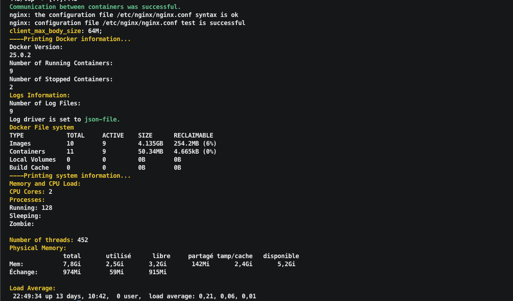

#  Docker System Checker Script

This script provides various functionalities to check the status and configuration of your Docker environment.
Currently only supporting our stack (Drupal - NextJs - Nginx) to verify containers connectivity.

##  Usage

1.  **Download the Script**:

`curl -sSL https://github.com/voidagency/sys-check/raw/main/sys-check.sh -o docker_system_checker.sh`

3.  **Make the Script Executable**:

`chmod +x docker_system_checker.sh`

4.  **Run the Script**: Execute the script by running the following command:

`./docker_system_checker.sh [project_name] [domain_name]`

Replace `[project_name]` with the project name used for container names (for [easypanel](https://easypanel.io/) it should simply be the project name). If not provided, Docker container communication checks will be aborted.

Replace `[domain_name]` with the domain name for which you want to check SSL certificates and curl subdomains. This argument is optional. If not provided, SSL certificate and subdomain checks will be skipped.

##  Features

###  1. Docker Environment Checks

-  Checks if Docker is installed.

-  Checks if Docker socket is accessible.

-  Verifies Docker group permissions [BETA].

###  2. Port Availability Check

-  Checks specified ports to see if they are available or in use.

###  3. Docker Hub Connection Check

-  Tests connection to Docker Hub.

###  4. Hostname and IP Verification

-  Retrieves the hostname, public IP address, and private IP address of the system.

###  5. SSL Certificate Check

-  Checks the SSL certificate validity for the provided domain name.

###  6. Docker Internal Communication Check

-  Checks communication between specified containers.

###  7. Docker Information Display

-  Prints Docker version, number of running and stopped containers, and log information.

###  8. System Information Display

-  Provides information about memory, CPU load, and system processes.

###  9. Subdomain Curl Check

-  Checks the reachability of specified subdomains for the provided domain.

##  Additional Notes

-  Ensure that you have the necessary permissions to execute Docker commands.

-  Some functionalities require additional packages such as `curl`.

## Screenshots

----------
